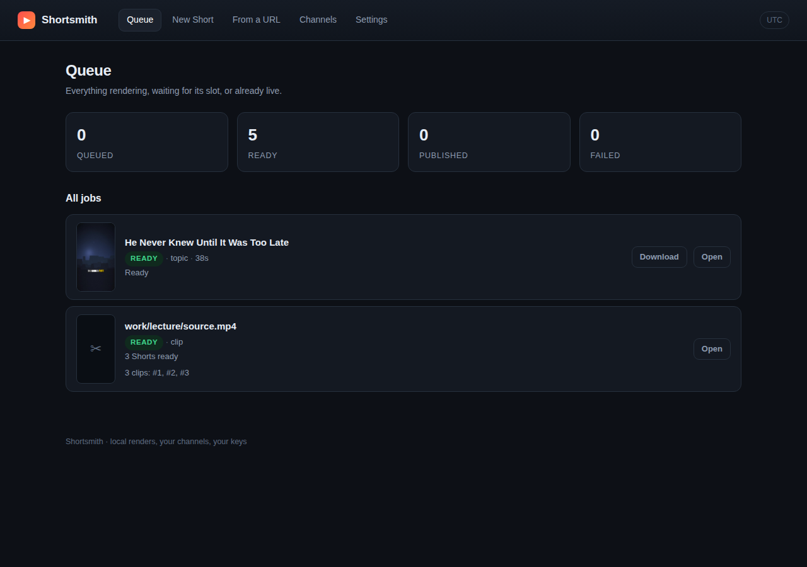
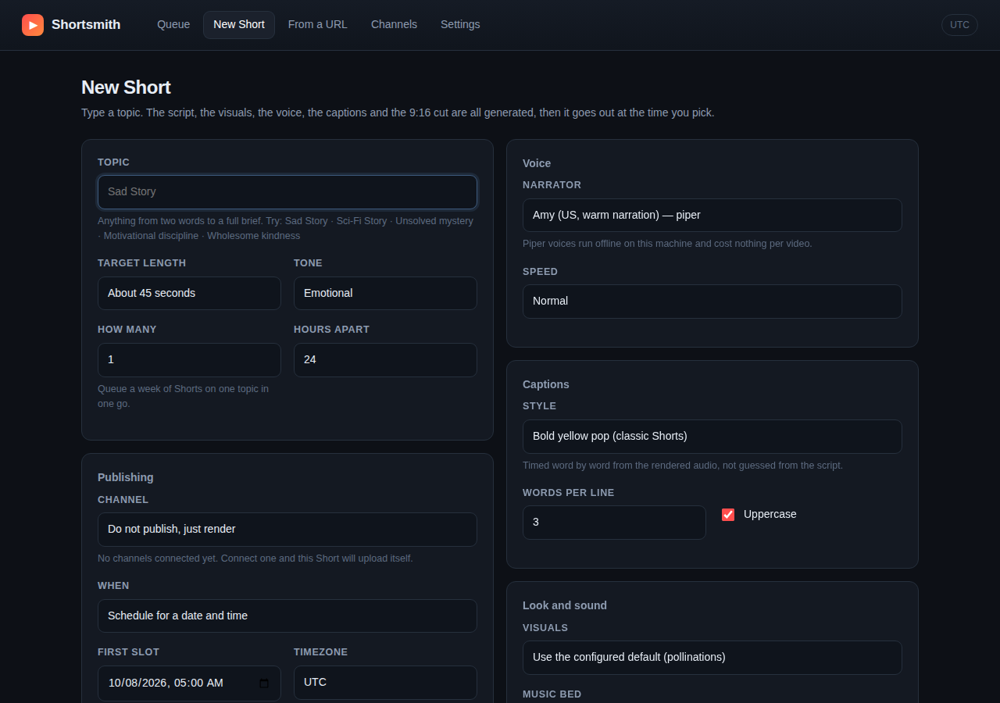
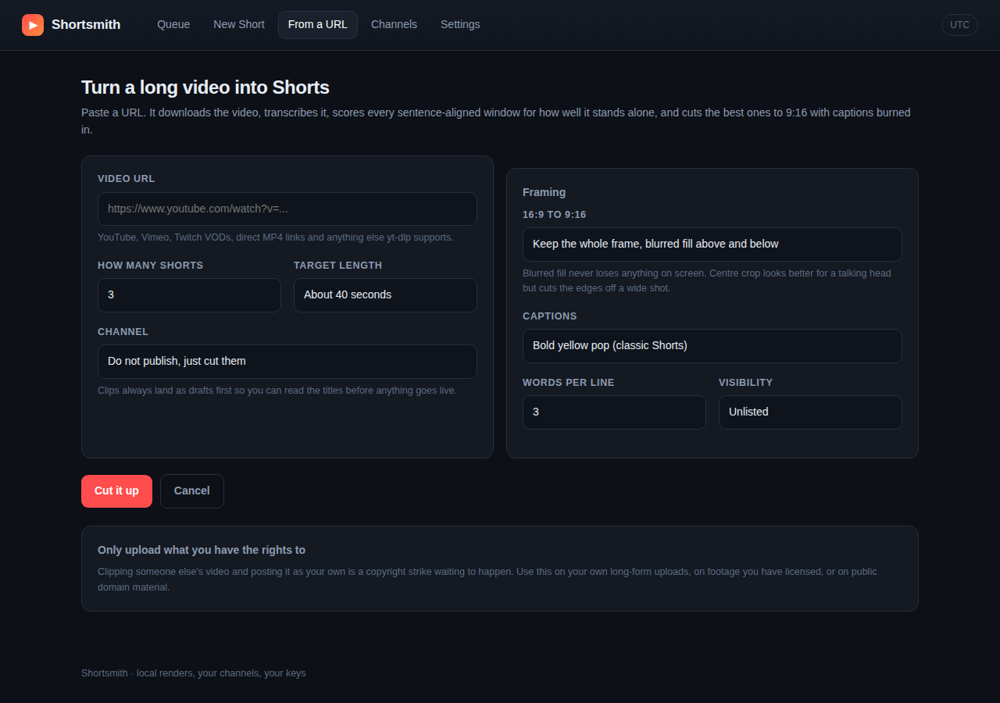
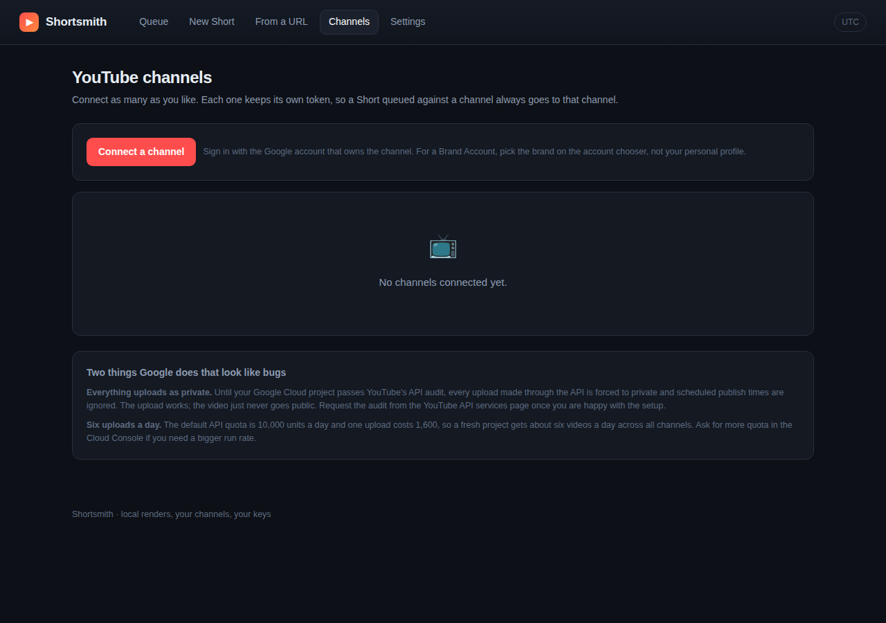
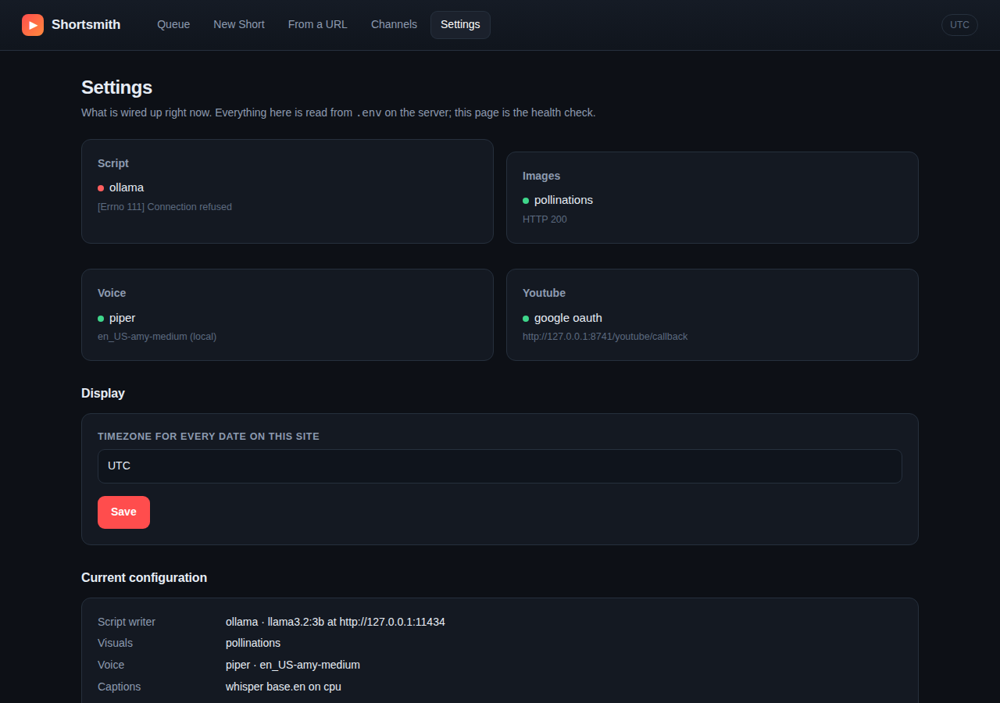
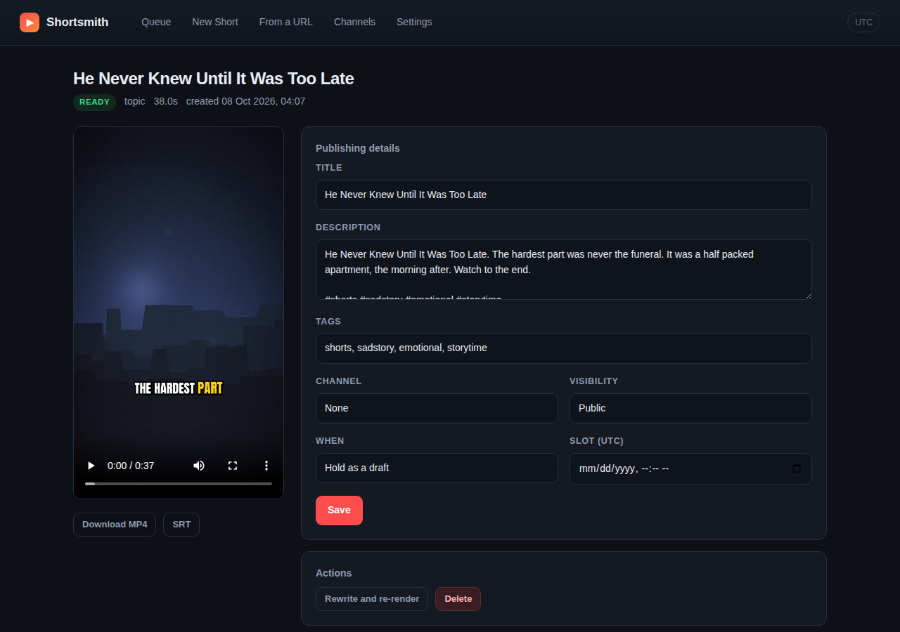
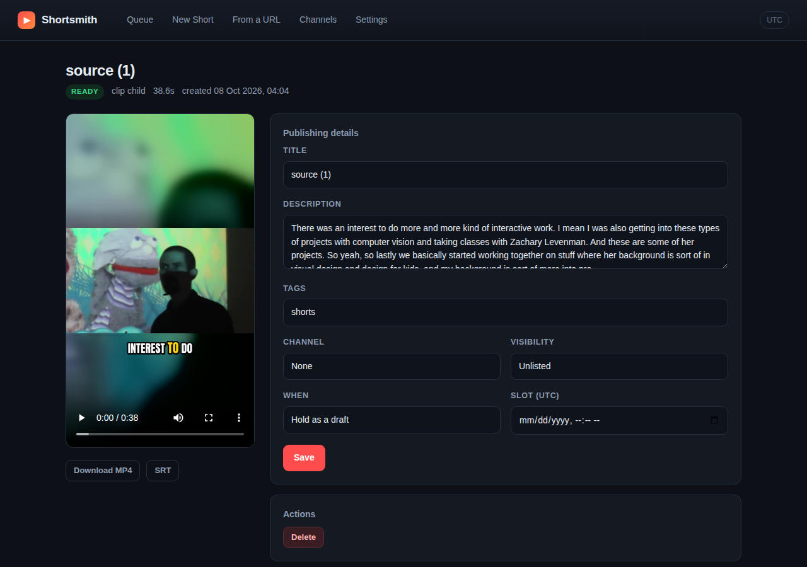

# Shortsmith

A self-hosted platform that turns a topic into a finished 9:16 YouTube Short and
publishes it to the right channel at the time you pick, and turns a long video
URL into several Shorts with AI clipping.

Everything runs on your own machine or server. No SaaS in the middle, no
per-video fee, and every part of the pipeline is a swappable provider so you are
never locked to one vendor.

```
topic ──▶ script ──▶ visuals ──▶ voice ──▶ captions ──▶ 9:16 render ──▶ schedule ──▶ YouTube
URL   ──▶ download ──▶ transcript ──▶ segment scoring ──▶ reframe + caption ──▶ N Shorts
```



---

## What it does

- **Connect many YouTube channels.** Each keeps its own OAuth token, so a Short
  queued against a channel always goes to that channel.
- **Type a topic, get a video.** "Sad Story", "Sci-Fi Story", or a full brief.
  The script, the images, the narration, the word-by-word captions and the Ken
  Burns motion are all generated, then muxed to a 1080x1920 MP4.
- **Schedule it.** Pick a date and time in your timezone. A worker renders ahead
  of the slot and uploads so YouTube publishes on the minute.
- **Batch it.** Queue 7 Shorts on one topic, 24 hours apart, in one submission.
- **Paste a YouTube URL.** It downloads, transcribes, scores every
  sentence-aligned window for how well it stands alone, and cuts the best ones to
  vertical with captions burned in.
- **Never silently fails.** Every provider has a fallback, and every job keeps its
  error text and retry count where you can read it.

## Everything is free and open source by default

| Stage | Default | Alternatives |
|---|---|---|
| Script | **Ollama** (local LLM, free, offline) | any OpenAI-compatible endpoint; built-in offline writer |
| Visuals | **FLUX.1-schnell** on a public Hugging Face Space (open weights, free token) | local **AUTOMATIC1111 / Forge**, local **ComfyUI**, Pollinations, **Pexels** stock, procedural plates |
| Voice | **Piper TTS** (MIT, offline, CPU) | **edge-tts** neural voices |
| Captions | **faster-whisper** (MIT, CPU) word timings | estimated timing if Whisper is unavailable |
| Video | **ffmpeg** |: |
| Download | **yt-dlp** |: |
| Database | **SQLite** | any SQLAlchemy URL |

The only paid thing in the stack is optional: a hosted LLM key if you would
rather not run Ollama.

---

## Screens

| | |
|---|---|
|  |  |
| **New Short** - topic, voice, caption style, visuals, music, channel and slot | **From a URL** - how many Shorts, target length, framing |
|  |  |
| **Channels** - connect as many as you like, with the Google setup spelled out | **Settings** - a health check for every provider |
|  |  |
| **A generated Short** - preview, the script it was built from, editable title and slot | **A clipped Short** - the three cuts taken from one long video |

---

## Install

Requires Python 3.10+, `ffmpeg`, `ffprobe` and `yt-dlp` on PATH.

```bash
git clone https://github.com/anirudhatalmale6-alt/shortsmith.git
cd shortsmith
python3 -m venv .venv
.venv/bin/pip install -r requirements.txt
cp .env.example .env          # edit it, or leave it: every setting has a default
./run.sh
```

Open <http://127.0.0.1:8080>. The background worker starts inside the web
process, so that one command is the whole system.

On first render it downloads the Piper voice (about 60 MB) and the Whisper model
(about 140 MB) once, then never again.

### Optional: the local LLM

```bash
curl -fsSL https://ollama.com/install.sh | sh
ollama pull llama3.2:3b          # about 2 GB, runs on CPU
```

Shortsmith finds it on `http://127.0.0.1:11434` automatically. Without it the
built-in offline writer takes over, so nothing breaks: the scripts are just less
varied.

### Visuals: pick one

The default is FLUX.1-schnell running on a public Hugging Face Space. Open
weights, free, and the best quality available without a GPU of your own. It does
need a free Hugging Face token, because anonymous callers get almost no GPU time:

1. Sign up at <https://huggingface.co/join>, no card needed.
2. <https://huggingface.co/settings/tokens>, create a token with read scope.
3. Put it in `.env` as `HF_TOKEN=hf_...`.

### Optional: local image generation

Point `IMAGE_PROVIDER=sdwebui` at an AUTOMATIC1111 / Forge instance started with
`--api`, or `IMAGE_PROVIDER=comfyui` at ComfyUI. Unlimited, offline, your own
checkpoints and LoRAs. This is the right answer if you have a GPU.

---

## Connecting a YouTube channel

The OAuth client has to live in **your** Google account, because the tokens it
issues control **your** channels. One-off, about five minutes:

1. <https://console.cloud.google.com> → create a project.
2. APIs & Services → Library → enable **YouTube Data API v3**.
3. OAuth consent screen → External → fill in the app name and your email → add
   yourself under **Test users**.
4. Scopes: `youtube.upload`, `youtube.readonly`, `youtube.force-ssl`.
5. Credentials → Create credentials → OAuth client ID → **Web application**.
6. Authorised redirect URI, exactly: `http://127.0.0.1:8080/youtube/callback`
   (or your `PUBLIC_BASE_URL` + `/youtube/callback`).
7. Put the client ID and secret in `.env`, restart, then hit **Connect a channel**.

Repeat the connect step for each channel. For a Brand Account, pick the brand on
Google's account chooser, not your personal profile.

### Two things Google does that look like bugs

**Everything uploads as private.** Until your Cloud project passes YouTube's API
audit, every API upload is forced to `private` and `publishAt` is ignored. The
upload succeeds and the video simply never goes public. Request the audit from
the YouTube API services page in the Cloud Console. This is Google's policy for
unaudited projects, not a defect here: Shortsmith surfaces the privacy status
YouTube actually returned so you can see it happening.

**About six uploads a day.** The default quota is 10,000 units/day and one upload
costs 1,600. Ask for more quota in the Cloud Console if you need a bigger run rate.

### Clipping from YouTube on a server

YouTube answers most datacentre IP ranges with *"Sign in to confirm you're not a
bot"*. Home and office connections are normally fine. On a VPS, export
`cookies.txt` from a signed-in browser and set `YTDLP_COOKIES=/path/cookies.txt`,
or set `YTDLP_PROXY`. You can also point the URL field at a file already on the
server: an absolute path, a `file://` URL, or a path relative to `data/`.

---

## How a render is put together

The ordering is the part that matters:

1. **Script.** One JSON object: hook, beats, closing line, and an image prompt per
   beat. Model replies are repaired and validated before use, and anything that
   is not usable falls through to the offline writer rather than losing the slot.
2. **Voice first, picture second.** Every beat is spoken and *measured*, then the
   still is cut to that exact length. Scene length is driven by the audio, which
   is why nothing drifts.
3. **Captions from the audio, not the script.** Whisper transcribes the narration
   that was actually rendered and returns word timings. Piper expands "3am" and
   "Dr." its own way; only the audio knows where each word landed.
4. **One look across the whole story.** Diffusion models have no memory between
   calls, so consistency is forced from the outside: one seed family per video
   (base + beat index), the same style suffix on every beat word for word, and a
   character sheet lifted from the establishing beat and repeated in every prompt
   that has a person in it. Art direction is a dropdown: cinematic, photoreal,
   painterly, anime, noir, dark fantasy.
5. **ASS, not SRT.** Per-word highlighting, a scale pop and a thick outline are
   the look that performs on Shorts, and SRT cannot express any of it.
6. **Ken Burns with linear expressions.** `zoompan` is fed `1+k*on/N` rather than
   the usual `zoom+0.0005`; the incremental form accumulates rounding error and
   visibly stutters on long holds.
7. **Ducked music.** `sidechaincompress` keyed off a copy of the voice, then a
   limiter, then `loudnorm` to -15 LUFS.

## How clipping picks its moments

A good Short is not any 40 seconds. Candidate windows are built from **sentence
boundaries**, never a fixed grid, and each is scored on:

- hook strength in the opening 18 words
- self-containment (ends on a full stop, does not open on "and" or "but")
- speech density: 2.0 to 3.6 words/second reads as natural pace
- a bell curve around your target length
- a penalty for channel housekeeping ("like and subscribe", "link in the description")

Overlapping windows are rejected, so three clips are three different moments
rather than three cuts of the same one. With an LLM configured it re-ranks the
shortlist and writes a title for each; without one the heuristic alone already
picks sensible cuts.

---

## Configuration

Every setting is an environment variable, read from `.env` if present. See
`.env.example` for the full list with comments. The ones you are most likely to
touch:

```ini
PUBLIC_BASE_URL=http://127.0.0.1:8080   # must match the Google redirect URI
APP_PASSWORD=                           # set it if the app is reachable publicly
LLM_PROVIDER=ollama                     # ollama | openai | offline
IMAGE_PROVIDER=pollinations             # pollinations | sdwebui | comfyui | pexels | gradient
TTS_PROVIDER=piper                      # piper | edge
PIPER_VOICE=en_US-amy-medium
WHISPER_MODEL=base.en                   # small.en and medium.en are more accurate, slower
GOOGLE_CLIENT_ID=
GOOGLE_CLIENT_SECRET=
```

## Running the worker separately

```bash
WORKER_ENABLED=0 .venv/bin/uvicorn shortsmith.main:app --host 0.0.0.0 --port 8080
.venv/bin/python -m shortsmith.worker
```

Jobs are claimed with a conditional `UPDATE`, so several workers can run against
the same database without picking up the same job twice.

## Tests

```bash
.venv/bin/python -m pytest -q
```

Covers the script writer and its JSON recovery, the caption builder and ASS
output, the clip scoring and overlap rejection, the timezone round trip, the job
state machine, and an end-to-end render that produces a real MP4 and asserts its
dimensions, duration and audio stream.

## Layout

```
shortsmith/
  main.py              FastAPI routes and pages
  worker.py            render + publish loop
  models.py            SQLAlchemy schema
  config.py            every setting, with defaults
  providers/
    llm.py             script writing: ollama | openai | offline
    offline_writer.py  the no-model story engine
    images.py          visuals: pollinations | sdwebui | comfyui | pexels | plates
    plates.py          the procedural cinematic background compositor
    tts.py             piper | edge
    captions.py        whisper word timings -> ASS + SRT
  pipeline/
    render.py          ffmpeg assembly
    clip.py            URL -> transcript -> segment scoring -> vertical cuts
  youtube/client.py    OAuth, upload, scheduling, error translation
  templates/, static/  the UI
```

## Licence and fair use

MIT. Clipping someone else's video and posting it as your own is a copyright
strike waiting to happen: use it on your own uploads, licensed footage, or
public domain material.
